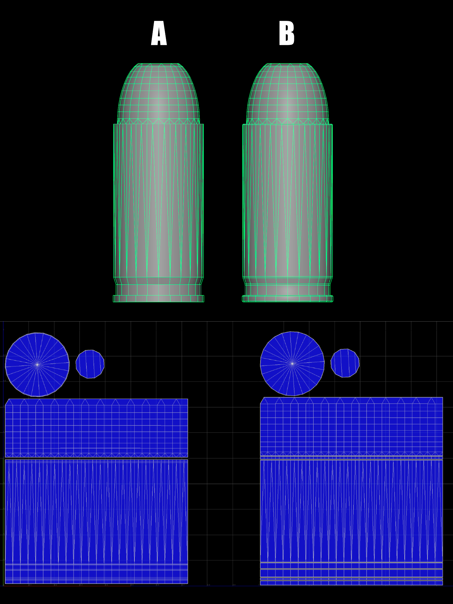
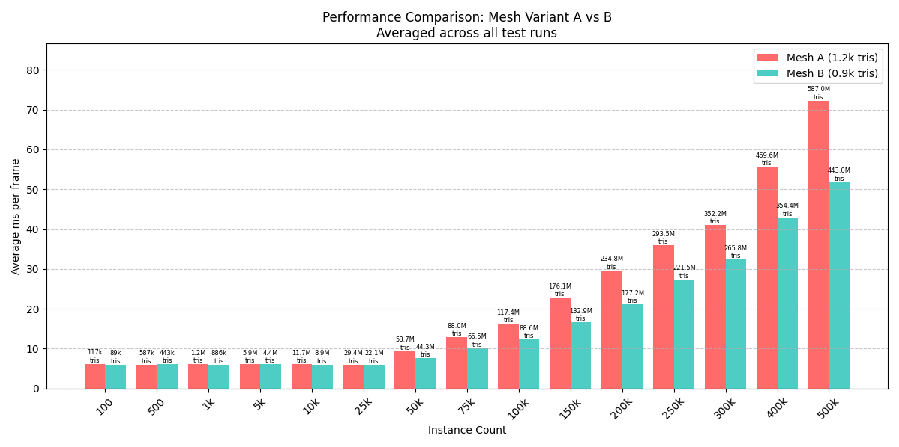

# Triangle Index Buffer Performance Benchmark

This project compares the performance characteristics of two different mesh optimization approaches, testing a hypothesis in response to [Eric Correia's article about vertex count importance](https://www.artstation.com/blogs/ericcorreia/2AMQl/vertice-the-truth-understanding-the-importance-of-vertices).



## Overview

The article argues that vertex count is more important than triangle count for performance, particularly regarding hard edges and UV seams. However, in the context of OpenGL and modern graphics programming, triangle rasterization can be more expensive than managing index buffer data. This benchmark tests these principles by comparing two approaches to handling hard edges:
- **Mesh A**: Using chamfered edges (~1.2k triangles)
- **Mesh B**: Using traditional UV splits at hard edges (~0.9k triangles)

My hypothesis was that while vertex count is crucial, triangle count differences might become more significant.



## Key Findings

- Both techniques perform similarly at typical usage scales
- Triangle rasterization costs become significant only at extreme scales (>50M triangles)
- At 500k instances:
  - Chamfered Method: ~70 ms/frame
  - UV Split Method: ~50 ms/frame

### Requirements
- [Odin Lang](https://odin-lang.org/)
- [Python](https://www.python.org/)

### Running the Benchmark
Execute the benchmark script:
```bash
./run_benchmark.bash
```
